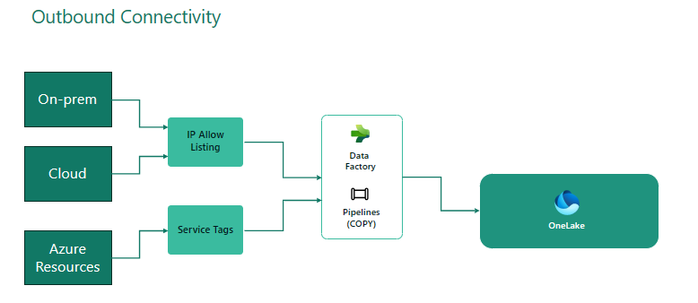

Microsoft Fabric enable users to collect, store, process, and analyze large volumes of data on Lakehouse using various data engineering capabilities using notebook, spark job definition and data pipelines.

## Connectivity

Users can ingest data  using notebook, spark job definition, data pipelines, data flows gen2 and paas services into Lakehouse and t-sql endpoint, spark notebooks and power bi direct lake mode to interactively consume ingested data from Lakehouse.

### Authentication

Microsoft Fabric supports AAD authentication to ingest data from common data sources such as adls gen2 storage account and other azure resources. However, some connections such as shortcuts to adls gen 2 storage account supports access keys and shared access signatures (SAS tokens)
.
We recommend you to use service princial or organization account to setup shorcuts on adls gen2 storage account.

**Common data ingestion & consumption patterns**

* **Loading data from adls gen2 storage account** - This is a common scenario where applications push data into adls gen2 storage account and the spark applications process and ingest data into bronze/silver and gold layer. The output of the bronze is typically stored as files and silver/gold datasets are registered as tables for curated consumtion. With Microsoft Fabric, users have three options

    - Option 1: Create adls shortcuts of staging or bronze data in lakehouse files section and register silver and gold curated datasets as table shortcuts for conumption. Please note this approach likely uses external applications such as Synapse Spark, Databricks Spark to process and ingest data and there by v-order read/write optimizations are missing.
    
        > As soon as Fabric Workspace Identity (equivalent to MSI in Azure) & Trusted access feature is available, use these features to create shortcuts on adls gen2 storage accounts. "Trusted Access" will ensure the connectivity between customer storage account and Microsoft Azure back bone using private peering even if customer disable public access on the storage account.  
    - Option 2: Copy data from adls gen2 storage account to Onelake using data flows gen2, pipelines. 
    - Option 3: Instead of loading and processing data in adls gen2 storage account, stage, process and load data into onelake files and tables section using Microsoft Fabric compute. This approach will enable both write and read optimizations across Microsoft Fabric compute and as data is already is on Onelake, the network restrictions do not apply.
    - Option 4: Use PaaS services such as ADF, Synapse Spark and Databricks to copy data into onelake and process data using Spark notebooks to process and ingest data as tables in lakehouse.
    
> If the storage account is protected by a firewall, both option 1 & 2 are not supported for data processing by spark workloads. However, customers can add onelake, power bi and lakehouse sql endpoints ip ranges to storage account and create shortcuts on storage accounts protected by firewall to consume the data from t-sql endpoint and power bi using direct lake mode.

> We recommend you to use option 1 for consuming data using power bi & t-sql endpoint and option 3 or 4 based on the scenario to ingest data into lakehouse. Option 4 allows you to ingest data from non adls gen2 data sources while with option 3, you need to push data to Onelake using external applications.

* **Loading data from onprem data sources sources** - If you need to ingest data from onprem sources, use on-prem data gateway to ingest data using data flows gen2 in Microsoft Fabric. Note that the scalability of data gateways and reliability of long running connections might impact the usability but these services are harnessed should be ready to use by GA.

In the near future, you should also able to use VNet Data Gateways to ingest data using data flows gen2.

* **Loading data using COPY activity from on-prem data sources** - If you need to copy data from on-prem data sources or azure sources that supports service tags, use copy activity with data factory to stage data into Onelake files section and then use spark notebooks, sjd's to process and curate data.

## Capacity Considerations

> **One Capacity Unit = Two Spark VCores.**
All spark operations are back-ground operations. Background operations are smoothed every 24 hours. You can review the average usage in capacity metrics app after smoothing.

|  Job Description | Job Type   |
|:---|---:|
| Notebooks scheduled via job scheduler  |  Interactive |
| Notebooks submitted by user | Interactive |
| Notebook orchestrated via pipeline | Interactive |
| Spark job Definition  | Batch |
| Livy endpoints submitted queries | Batch  |
| REST API to perform data plane operations | Batch |

#### Scaling & Bursting

* Spark operations use bursting to allow jobs parallelism. If your current capacitiy allows you to run a spark job on F8, with bursting factor (x), you can x jobs on F8 capacity in parallel given all jobs are configured similarly.
* Capacity auto scale does not auto scale a spark job. In your spark job definition, you can only configure to auto scale a spark pool witin capacity limits. For example: a spark pool  with 16 v-cores or 4 small nodes (F8 capacity) does not scale 3x of its capacity, i.e. 48 v-cores or 12 nodes. The max number of nodes you can configure spark pool is 4.

#### Concurrency Throttling and Queueing

TODO: 
* Queuing is applied to batch jobs only.
* Interactive jobs will be throttled if 
