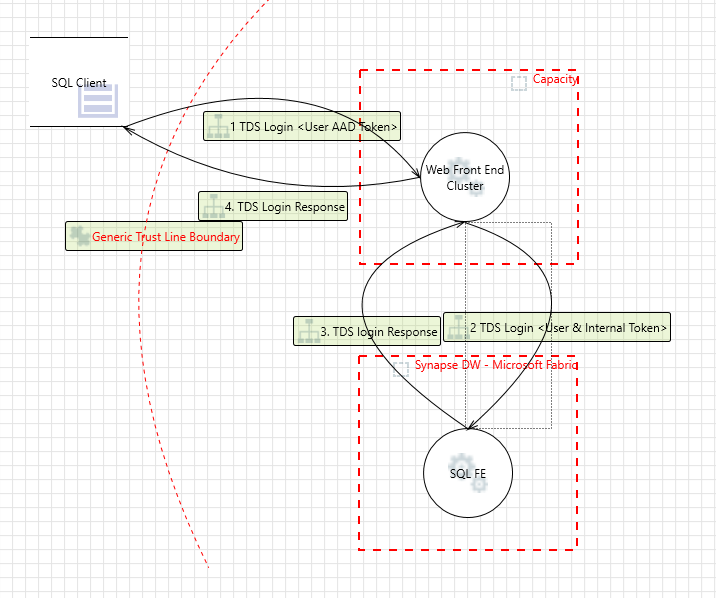

## Connectivity

* T-SQL endpoint uses Tabular Data Stream(TDS) protocol to connect to a Synapse Data Warehouse in Microsoft Fabric.
* Microsoft Fabric uses proxy connections to establish connectivity. Here is a connectivity view of Fabric DW. 
* Proxy connections can lead to connection timeout or transient connection failures. When executing long running queries, it is recommended to embed retry logic to ETL/ELT orchestration layer.
* Microsoft Fabric supports [various drivers](https://learn.microsoft.com/en-us/sql/connect/sql-connection-libraries?view=sql-server-ver16#drivers-for-relational-access) for relational access. Some of the common drivers used to connect to Microsoft Fabric DW are 
    - Microsoft ODBC Driver for SQL Server
    - ADO.NET
    - Microsoft OLEDB Driver for SQL Server
    - Microsoft JDBC Driver for SQL Server

* ```Note: Direct Lake mode connectivity to Synapse Data Warehouse in Microsoft Fabric will be available post GA```

## Supported Authentication Modes by Fabric DW

Microsoft Fabric supports only Azure Active Directory (Azure Entra) authentication.

* For interactive workloads, Microsoft recommend customers to use pass through authentication.
* For ETL/ELT, automation & ALM, Microsoft recommend customers to user service principal based authentication. 
```Note: Allow Service Principals to use Power BI APIs must be turned on in the admin portal to add a service principal explicitly to a workspace to access Fabric DW```
</br>


```If your workloads are to be shared between tenants, then the service principal created in a tenant should be registered in other tenant(s) and should have admin consent to access resources in new tenants. Please note that the admin consent is mandatory to use the same service principal in multiple tentants. For example: If a ISV host data in ISV tenant and needs access to data in customer tenant, then the service principal that is created in ISV tenant must be registered in customer tenant using admin consent and then provide permissions on the data sources```

* SQL Authentication is not supported by Microsoft Fabric.
* Workspace Managed Identity (equivalent to Managed Service Identity) will be available post GA. </br>
```Note: For automation purposes, Microsoft recommends customers\ISV's to use Service Principal based authentication.```

## Patterns to Ingest Data into Synapse Data Warehouse in Microsoft Fabric

Following are few options available to ingest data into Synapse Data Warehouse in Microsoft Fabric.

* COPY INTO from storage account.
    - storage accounts protected by VNET/PE will be bypassed using "trusted access" feature in Microsoft Fabric. Available post ga
* Use Azure Data Factory or Synapse Pipelines to ingest data into Fabric Data Warehouse. Note that both these services using COPY command to ingest data into DW. Once Ingested, use stored procedures to transform data for performance.
    - Azure Data Factory and Synapse Analytics has ability to connect to firewall protected data sources. This option aligns if customers are using either of these services to ingest data into Fabric DW.
* Ingest data with Microsoft Fabric Data Factory using Data Flow Gen2, Fabric Pipelines. Remember that these options might not be performant as the product is in still in preview.
    - While Data Flow Gen2 supports gateway to connect to data sources protected by firewall, Fabric pipelines do not.
* Fabric DW is not recommended for real-time ingestion. For real-time ingestion workloads, use event streams or spark streaming with Lakehouse. The data ingested as table structures in Lakehouse can be consumed using t-sql endpoint.

## Data Access Patterns for Consumption

t-sql endpoint supports two data access patterns

* Direct Query - This access pattern is commonly used to submit user queries using t-sql endpoint. Every client including 3rd party tools such as dbt, qlik compose must to use t-sql endpoint to ingest/query data in Microsoft Fabric DW.
* One Lake Access - Data ingested by DW in Microsoft Fabric is available to external readers such as Fabric Spark, Azure Synapse Spark, Azure Databricks and Power BI direct lake for consumption purposes without using sql engine.

> Points to consider:
>
> - One lake access is read only access pattern. Fabric DW does not have a staging files section unlike Lakehouse artifact.
>
> - Fabric DW will support data ingestion using COPY INTO from Lakehouse files by GA.
>
> - Cross Database queries are supported within workspace for now but cross database queries across workspaces will be supported by GA+.

## Performance & Capacity Considerations to use t-sql endpoint

* All Databases (DW/LH) hosted in a single workspace are registered to a single endpoint and capacity. Please consider following
    - Metadata operations on a single FE can be slow if number of objects are in the order of tens of thousands.
    - A single FE can cause slowness in returning large amounts of data due to network, cross region or client irrespective of capacity & compute size.
    - Cross database queries will use the capacity of the t-sql endpoint that runs the sql queries.
    - Maximum number of concurrent connections allowed per workspace SQL FE are 32767 and the maximum number of concurrent query executions depend upon the capacity units/capacity resources.

* ```TODO```
    - Resource Considerations - TODO
    - Optimizations & Performance Considerations.```

## Development, Automation & ALM

* Customers can use CRUD Api's to create and manage databases but continuous integration and deployment is managed via git integration, database projects and sql packages.
    - Application lifecycle of database can be managed in two ways
        - Fabric GUI, UI driven approach
            - Git Integration can be enabled on a workspace in Fabric GUI. As a customer/ISV, you can version control database code using Fabric GUI.
            - Fabric GUI + deployment pipelines will enable you to push changes from dev -> test -> prod. The deployment pipelines allows users to manage database state in an incremental fashion.
        - Database Projects
            - Fabric DW supports database projects via Azure Data Studio. In near future, database projects will be supported by SSDT as well. Customers can build database code in Azure Data Studio, SSDT and version control using these tools.
            - Once developed, the database code can be deployed using sql package incrementally.

* We recommend you to use GUI approach for small databases. For medium/large complex workloads, use SSDT/ADS + SQl Package to manage ALM of your database. 


    |  Feature | Release Timeline   |
    |:---|---:|
    | Database CRUD API  |  GA |
    | Database Git Integration in Fabric GUI | Post GA, CY 2023 Q4 |
    | Database Projects in VS Code & ADS  | GA |
    | SQL Package | GA  |
    | Deployment Pipelines in Fabric GUI | GA |

## Migration

Microsoft is providing tooling to migration Azure Synapse Gen2 Dedicated SQL Pool to Synapse Data Warehouse in Microsoft Fabric. Migration tooling provided by Microsoft will will cover following.

* Database Code - In Scope
* Data - In Scope
* ELT/ETL tools - Out of Scope

Migration tooling is provided in a phased approach.

| Approach | Capabilities | Release Timeline |
|:---|:---: |---:|
| PowerShell Scripts + Documentation | DDL Extract, DML Assessment, Data Extraction from Gen2 & Data Import to Fabric DW   |  GA |
| DML Assessment & T-SQL Converter | Validate & Convert Gen 2 T-SQL to Fabric DW | Post GA, CY 2023 Q4 |
| LLM | Convert T-SQL scripts using Fabric GUI | GA |
| End-End migration tooling | Gen2 DW Assessment, Code/DML Conversion, Data Import from Gen2 & Export to Fabric DW | CY 2024, Q3 |

## FAQ's


